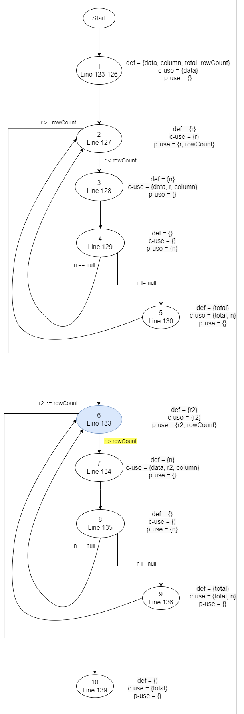
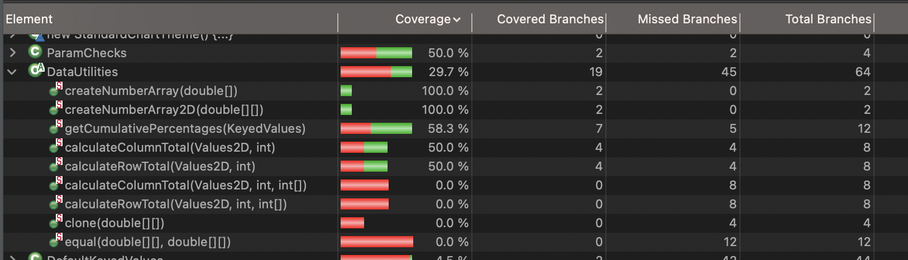

**SENG 438 - Software Testing, Reliability, and Quality**

**Lab. Report #3 – Code Coverage, Adequacy Criteria and Test Case Correlation**

| Group \#5:      |     |
| -------------- | --- |
| Ethan Rigby          |
| Labib Afsar Ahmed    |
| Mohammed Alshoura    |
| Danielle Jourdain |

# 1 Introduction

This lab focused on building our knowledge of unit testing from the previous lab. We were given the chance to reanalyze the same code from the second lab while given a chance to improve upon the tests made. The main difference between lab 2 and 3 was: rather than using a blackbox approach to unit testing, this lab allowed us to view the actual code and create unit tests based on functions (whitebox testing) while also allowing us to introduce a test suite. This means that our test cases can be more accurate to what is needed to be tested by the function than blackbox testing allowed for. Thus, allowing us to more thoroughly create tests.

# 2 Manual data-flow coverage calculations for X and Y methods

## Intersects in Range Data-flow coverage

For the method intersects in Range. The Data flow graph is as follows:

Each node is a statement, and the def-use sets are shown above each node, the DU-pairs for the variables are as follows:

| Variable (V) | Defined at node (n) | dcu(v, n) | dpu(v,n)       |
|--------------|---------------------|-----------|----------------|
| b0           | 1                   | {4}       | {[2,3], [2,4]} |
| b1           | 1                   | {3,4}     |                |
| Total:       |                     | 3         | 2              |

CU = 3      ,    PU = 2  
CUc = 3   
PUc = 2  CUc, and PUc were found in the following tests:  (intersectsRangeFullyOverlapsSpecifiedRange, and            intersectsRangePartiallyOverlapingSpecifiedRange)

### There were no infeasible cases

coverage is found by:  
(2+3)/(2+3) = 100%

## calculateColumnTotal in DataUtilities Data-flow coverage

For the method intersects in Range. The Data flow graph is as follows:

The def-use sets are shown to the right each node, the DU-pairs for the variables are as follows:

| Variable (V)   | Defined at node (n) | dcu(v, n) | dpu(v,n)        |
|----------------|---------------------|-----------|---------------- |
| data           | 1                   | {1,3,7}   |                 |
| column         | 1                   | {3,7}     |                 |
| total          | 1,5,9               | {5,9,10}  |                 |
| rowCount       | 1                   |           |{2,6}            |
| r              | 2                   | {2,3}     |{[2,3], [2,6]}   |
| n              | 3                   | {5}       |{[4,2], [4,5]}   |
| r2 (infeasible)| 6                   | {6,7}     |{[6,7], [6,10]}  |
| n (infeasible) | 7                   | {9}       |{[8,6],[8,9]}    |
| Total:         |                     | 14        | 10              |

## Nodes 6-9 are infeasible since r2 is defined to be 0 at line 133, and rowCount is always >= 0, so the second for loop is never entered

CU = 14      ,    PU = 10  
CUf = 6   
PUf = 4  
CUc = 8   
PUc = 5  CUc, and PUc were found in the following tests:  (calculateColumnTotalForTwoValues,            calculateColumnTotalReturnsZeroForInvalidValue, and calculateColumnTotalReturnsZeroForEmptyValue2D)

### The feasible Path missed is [3,4,5] since we don't test what happens when data with a valid rowcount has null for values

coverage is found by: 
(8+5)/((14+10)-(6+4)) = 92.85%

# 3 A detailed description of the testing strategy for the new unit test

To develop new unit tests, we first developed a plan to ensure our test suite completed all the metrics that were required. To do this, we first began by looking at the method coverage for each class. We noted what the current value was from the Eclipse EclEmma tool, and noted how many more methods we would need to develop tests for to hit the 60% coverage goal mentioned in the assignment. For the Range class this meant developing tests for 13 more methods in addition to the ones from Assignment 2. For the DataUtilities class, [FILL IN LATER]. Once we had done this, we re-ran the coverage tool to ensure we had covered enough methods.

After we had noted what was still needed to acheive our method coverage goal, we moved on to looking at the branch coverage for each method. We began by running the branch coverage tool in EclEmma. We noted these values, and also looked at the source code. Then we looked at the possible paths for the method, as well as the tests we had already written and what paths they covered. We then wrote new cases to cover all of the missing branches that were possible to reach. there were some branches that were not possible to reach, which were left un-tested. After this was done, we re-ran the coverage tool to ensure we had covered more branches and reached our goal of 70%.

After completing the test cases to improve branch coverage, we finally moved on to statement coverage. To check our current progress, we used the line coverage option in EclEmma. We then examined the results in detail to check which methods had lines that had not been tested, then wrote methods to ensure these got covered to. After this was done, we re-ran the coverage tool to ensure our goal of 90% statement coverage had been acheived.

# 4 A high level description of five selected test cases you have designed using coverage information, and how they have increased code coverage

Text…

# 5 A detailed report of the coverage achieved of each class and method (a screen shot from the code cover results in green and red color would suffice)

## 5.1 Range Coverage

### 5.1.1 Before

Method coverage:

Branch coverage:

Statement coverage:

### 5.1.2 After

Method coverage:

Branch coverage:

Statement coverage:

## 5.2 DataUtilities Coverage

### 5.2.1 Before

Method coverage:

Branch coverage:

Statement coverage:

### 5.2.2 After

Method coverage:

Branch coverage:

Statement coverage:

# 6 Pros and Cons of coverage tools used and Metrics you report

The coverage tool that we used for this lab was called Eclipse EclEmma. It was nice that the tool was built into eclipse which made it very easy to implement and use. We also found that it was useful to use when examining the classes that tests were being made for as it highlighted each line with different colours based on what has been covered by tests and what has been missed. However, it seemed like some code that should be covered by our current tests in the DataUtilities class was not actually being covered after running this tool. After, we found out that EclEmma has trouble dealing with abstract classes and instead will mark it as being missed. As well, the tool did not have a condition coverage, so we had to change that type of coverage to be a method coverage instead.

The types of coverages used by our group were:
[HOW DO YOU ADD BULLET POINTS]
Line Coverage
Branch Coverage
Method Coverage

# 7 A comparison on the advantages and disadvantages of requirements-based test generation and coverage-based test generation

Coverage-based test generation allowed us to be more efficient when designing test cases. We noticed when we used requirements-based test generation, sometimes we would have many tests covering the same lines of code and branches! Since we were doing black-box testing, we had no way of knowing this. However, when working with white-box testing and coverage-based generation, we were able to be more efficient when designing the tests.

Although our tests were more efficient when using coverage-based generation, our test creation process was slowed down. Rather than just reading the documentation for each method, we had to read through and understand the source code in order to write good quality tests for it.

# 8 A discussion on how the team work/effort was divided and managed

We began by meeting and setting up our environment for this assignment together. We then ran the coverage tools together to ensure we all had the same values and understood what the results meant. After this, we divided up the work into 4 sections. The first section was creating the manual data-flow charts. The second section was updating the test suite for the Range tests that had been developed in Assignment 2. The third section was writing tests for the methods that had not been tested in Assignment 2. The final section was updating the tests for DataUtilities from Assignment 2. Each team member began working on one section, and updated the rest of the team with their progress. This way, we could all ensure we had something to work on, and that the workload was equally balanced. When one team member was finished with their section, they would notify the rest of the team, and then start working in another section where someone else was struggling.

# 9 Any difficulties encountered, challenges overcome, and lessons learned from performing the lab

During this lab, our group encountered a few challenges that we had to overcome. The first difficulty we faced was setting up the external libraries for the lab. After importing all the libraries given to us by the lab, it seemed that one was missing and caused all of our code to not run properly. The library that was missing was the hamcrest-library as the file we had only containted the hamcrest-core. To fix this, we had to copy over the old hamcrest-library from lab 2. Another difficulty we faced was close to the end of testing. There were parts in the code of DataUtilities that were not being covered for some reason even though it seemed as if nothing was stopping them from running. We later found out that EclEmma could not tell that we could not instantiate this class as it was abstract. It instead thought we were not covering it in our tests and marked it red after running the coverage tool.

# 10 Comments/feedback on the lab itself

This lab was a good way to introduce us to whitebox unit testing while allowing us to try it out on a familiar project. It allowed us to implement the code coverage techniques that we have been learning in an environment that we have already explored. This let us focus on the main takeaways of the lab instead of having to read a bunch of new code and figure out what it does. However, it would have been useful to contain all the libraries that were needed as it seemed that one was missing and we had to figure out why the code wouldn't run on our own.
